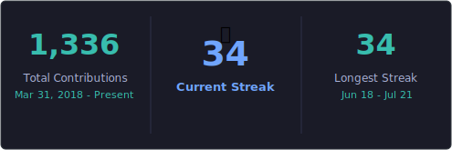
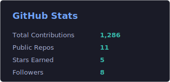
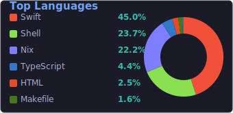

<!-- ======================= HEADER ======================= -->

  

&nbsp;

&nbsp;

<!-- ======================= ABOUT ======================= -->
<h2>&nbsp; About</h2>

I am Kadir, a software engineer based in Erlangen, Germany. I studied Mechatronics and
Precision Engineering at Nuremberg University of Applied Sciences, graduating with a
B.Eng. in 2024.

At Siemens Healthineers I work on data infrastructure - designing and maintaining
Snowflake data warehouses, building and optimising data pipelines, managing access
governance, and writing technical documentation for cross-team data systems.

The rest of my work sits where software meets the physical world: automation, tooling,
and the systems that connect them. Lately that increasingly means building with LLMs and
the Model Context Protocol - giving models real access to tools and data rather than
just chat.

- Building automation and developer tooling around Claude and MCP.
- Data engineering and Snowflake infrastructure at Siemens Healthineers.
- Comfortable across software, embedded systems, and data work.
- Always poking at something new to see how it ticks.

<!-- ======================= AI STACK ======================= -->
<h2>&nbsp; AI &amp; Agents</h2>

 

<!-- ======================= TECH STACK ======================= -->
<h2>&nbsp; Languages &amp; Tools</h2>

 

![JSON](https://img.shields.io/badge/JSON-000000?style=for-the-badge&logo=data:image/svg+xml;base64,PHN2ZyBmaWxsPSIjZmZmZmZmIiByb2xlPSJpbWciIHZpZXdCb3g9IjAgMCAyNCAyNCIgeG1sbnM9Imh0dHA6Ly93d3cudzMub3JnLzIwMDAvc3ZnIj48dGl0bGU+SlNPTjwvdGl0bGU+PHBhdGggZD0iTTEyLjA0MyAyMy45NjhjLjQ3OS0uMDA0Ljk1My0uMDI5IDEuNDI2LS4wOTRhMTEuODA1IDExLjgwNSAwIDAwMy4xNDYtLjg2MyAxMi40MDQgMTIuNDA0IDAgMDAzLjc5My0yLjU0MiAxMS45NzcgMTEuOTc3IDAgMDAyLjQ0LTMuNDI3IDExLjc5NCAxMS43OTQgMCAwMDEuMDItMy40NzZjLjE0OS0xLjE2LjEzNS0yLjM0Ni0uMDQ1LTMuNDk5YTExLjk2IDExLjk2IDAgMDAtLjc5My0yLjc4OCAxMS4xOTcgMTEuMTk3IDAgMDAtLjg1NC0xLjYxN2MtMS4xNjgtMS44MzctMi44NjEtMy4zMTQtNC44MS00LjNhMTIuODM1IDEyLjgzNSAwIDAwLTIuMTcyLS44N2gtLjAwNWMuMTE5LjA2My4yNC4xMzIuMzQ1LjIwMS4xMi4wNzQuMjM5LjE0Ni4zNTEuMjI1YTguOTMgOC45MyAwIDAxMS41NTkgMS4zM2MxLjA2MyAxLjE0NSAxLjc5NyAyLjU0OCAyLjIxOCA0LjA0MS4yODQuOTgyLjQzNCAxLjk5OC40OTUgMy4wMTcuMDQ0Ljc0My4wNDQgMS40OTEtLjA0NyAyLjIyOS0uMTQ5IDEuMjctLjU1NCAyLjUxLTEuMjI4IDMuNTk2YTcuNDc1IDcuNDc1IDAgMDEtMS45MDMgMi4wODRjLTEuMjQ0LjkyOC0yLjg3NyAxLjQ4Mi00LjQzNiAxLjExNGEzLjkxNiAzLjkxNiAwIDAxLS43NDgtLjI1OCA0LjY5MiA0LjY5MiAwIDAxLS43NzktLjQ1IDYuMDggNi4wOCAwIDAxLTEuMjQ0LTEuMTA1IDYuNTA3IDYuNTA3IDAgMDEtMS4wNDktMS43NDcgNy4zNjYgNy4zNjYgMCAwMS0uNDk0LTIuNTRjLS4wMy0xLjI3My4yMjUtMi41NTMuODU0LTMuNjdhNi40MyA2LjQzIDAgMDExLjY2My0xLjkxOGMuMjI1LS4xNzguNDY0LS4zMzMuNzA0LS40NzlsLjAxNi0uMDA3YTUuMTIxIDUuMTIxIDAgMDAtMS40NDEtLjEyIDQuOTYzIDQuOTYzIDAgMDAtMS4yMjguMjRjLS4zNTkuMTItLjcwNC4yNy0xLjAxOS40NWE2LjE0NiA2LjE0NiAwIDAwLS43MzMuNDk0Yy0uMjExLjE4LS40Mi4zNi0uNjE1LjU1NS0xLjEyMyAxLjE1My0xLjc2OCAyLjY4Mi0yLjAyMiA0LjI1Ni0uMTUuOTczLS4xNSAxLjk2LS4wOTEgMi45NS4xMDUgMS4zOTUuMzkxIDIuNzg3Ljk0NSA0LjA2MmE4LjUxOCA4LjUxOCAwIDAwMS4zNDggMi4xNzMgOC4xNCA4LjE0IDAgMDAzLjEzMiAyLjIzIDcuOTM0IDcuOTM0IDAgMDAyLjExMy41NGMuMDc0LjAxNS4xNDkuMDE1LjIwOS4wMTV6bS0yLjkzNC0uMzk4YTQuMTAyIDQuMTAyIDAgMDEtLjQ1LS4yMjggOC41IDguNSAwIDAxLTIuMDM4LTEuNTM0Yy0xLjA5NC0xLjEzNy0xLjgyNy0yLjU2Ni0yLjI0Ny00LjA4YTE1LjE4NCAxNS4xODQgMCAwMS0uNDk1LTMuMTcyIDEyLjE0IDEyLjE0IDAgMDEuMDQ2LTIuMDgyYy4xMzUtMS4yNTcuNDk1LTIuNTAxIDEuMTI0LTMuNThhNi44ODkgNi44ODkgMCAwMTEuNzgzLTIuMDUzIDYuMjMgNi4yMyAwIDAxMS42MzMtLjkgNS4zNjMgNS4zNjMgMCAwMTMuNTIyLS4wNDVjLjAyOSAwIC4wMjkgMCAuMDQ1LjAzLjAxNS4wMTUuMDQ1LjAxNS4wNi4wMy4wNDUuMDE2LjEwNC4wNDUuMTY1LjA3NC4yMzkuMTIuNDc5LjI3MS43MDQuNDJhNi4yOTQgNi4yOTQgMCAwMTIuMDk3IDIuNTAyYy40Mi45MTQuNjE1IDEuOTM0LjYzMSAyLjkzOC4wMTQgMS4wNzktLjE4IDIuMTU3LS42NDUgMy4xNDZhNi40MiA2LjQyIDAgMDEtMi42MzggMi44MzJjLjA5LjAzLjE4LjA0NS4yNzEuMDc1LjIyNS4wNDQuNDQ5LjA3NC42ODguMDc0IDEuNDY4LjA0NSAyLjg5Mi0uNjYgMy45NC0xLjY0Ny4xOTUtLjE4LjM3NS0uMzc1LjU0LS41ODUuMjI1LS4yNy40MzUtLjU0LjYxNC0uODIzLjIzOS0uMzc1LjQzNS0uNzUuNjE0LTEuMTU0YTguMTEyIDguMTEyIDAgMDAuNTA5LTEuNjY0Yy4xOTYtMS4wMDQuMjExLTIuMDIyLjE0OS0zLjAyNi0uMTM1LTIuMDIyLS42NzMtNC4wNDUtMS44NDItNS43MjRhOS4wNTQgOS4wNTQgMCAwMC0uNTU1LS43MTkgOS44NjggOS44NjggMCAwMC0xLjA2My0xLjAzNCA4LjQ3NyA4LjQ3NyAwIDAwLTEuMzYzLS45MTUgOS45MjcgOS45MjcgMCAwMC0xLjY5Mi0uNTk4bC0uMy0uMDZjLS4yMDktLjAzLS40Mi0uMDQ0LS42MzQtLjA2YTguNDUzIDguNDUzIDAgMDAtMS4wMTUuMDE2Yy0uNzA0LjA0NS0xLjQxMi4xNi0yLjExMi4zMzdDNS43OTkgMS4yMjcgMi44NjMgMy41NjYgMS4zIDYuNjdBMTEuODM0IDExLjgzNCAwIDAwLjIzOCA5LjgwMWExMS44MSAxMS44MSAwIDAwLS4xMDQgMy43NzVjLjEyIDEuMDIuMzc0IDIuMDIzLjc3OCAyLjk3Ny4yMjcuNTcuNTExIDEuMTI0LjgyNSAxLjY0OCAxLjA5NCAxLjc4MyAyLjY4MyAzLjIzNiA0LjUxIDQuMjQuNjg4LjM5IDEuNDA4LjY5IDIuMTU3Ljk0NC4yMjYuMDc0LjQ1LjE1LjY4OS4yMXoiLz48L3N2Zz4=&logoColor=white)

<!-- ======================= STATS ======================= -->
<h2>&nbsp; Activity</h2>

  

<picture>
  <source media="(prefers-color-scheme: dark)" srcset="./assets/contributions-dark.svg"/>
  <source media="(prefers-color-scheme: light)" srcset="./assets/contributions.svg"/>
  
</picture>

<!-- ======================= CONTACT ======================= -->
<h2>&nbsp; Contact</h2>

Feel free to reach out on
<a href="https://www.linkedin.com/in/kadir-sert/">LinkedIn</a>.

<!-- ======================= FOOTER ======================= -->

 

