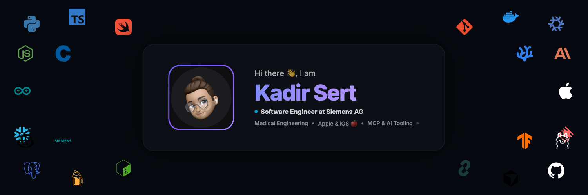
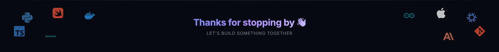

<!-- ======================= HEADER ======================= -->

  

&nbsp;

&nbsp;

<!-- ======================= ABOUT ======================= -->
<h2>&nbsp; About</h2>

I am Kadir, a software engineer at Siemens AG based in Erlangen, Germany. I studied
Mechatronics and Precision Engineering at Nuremberg University of Applied Sciences and
finished my B.Eng. in 2024.

Most of my work sits where software meets the physical world: automation, tooling, and
the systems that tie them together. Lately a lot of that revolves around building with
LLMs and the Model Context Protocol, giving models real access to tools and data instead
of just chat.

- Currently building automation and developer tooling around Claude and MCP.
- Comfortable across software, embedded systems, and data work.
- Always poking at something new to see how it ticks.

<!-- ======================= AI STACK ======================= -->
<h2>&nbsp; AI &amp; Agents</h2>

 

<!-- ======================= TECH STACK ======================= -->
<h2>&nbsp; Languages &amp; Tools</h2>

 

<!-- ======================= STATS ======================= -->
<h2>&nbsp; Activity</h2>

 

  

<picture>
  <source media="(prefers-color-scheme: dark)" srcset="./assets/contributions-dark.svg"/>
  <source media="(prefers-color-scheme: light)" srcset="./assets/contributions.svg"/>
  
</picture>

<!-- ======================= CONTACT ======================= -->
<h2>&nbsp; Contact</h2>

Happy to talk shop. Reach me on
<a href="https://www.linkedin.com/in/kadir-sert/">LinkedIn</a>.

<!-- ======================= FOOTER ======================= -->

 

